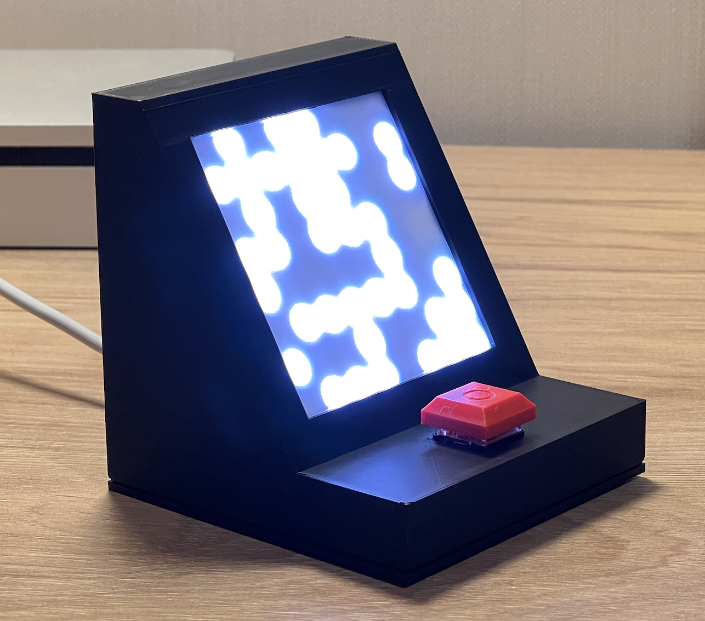
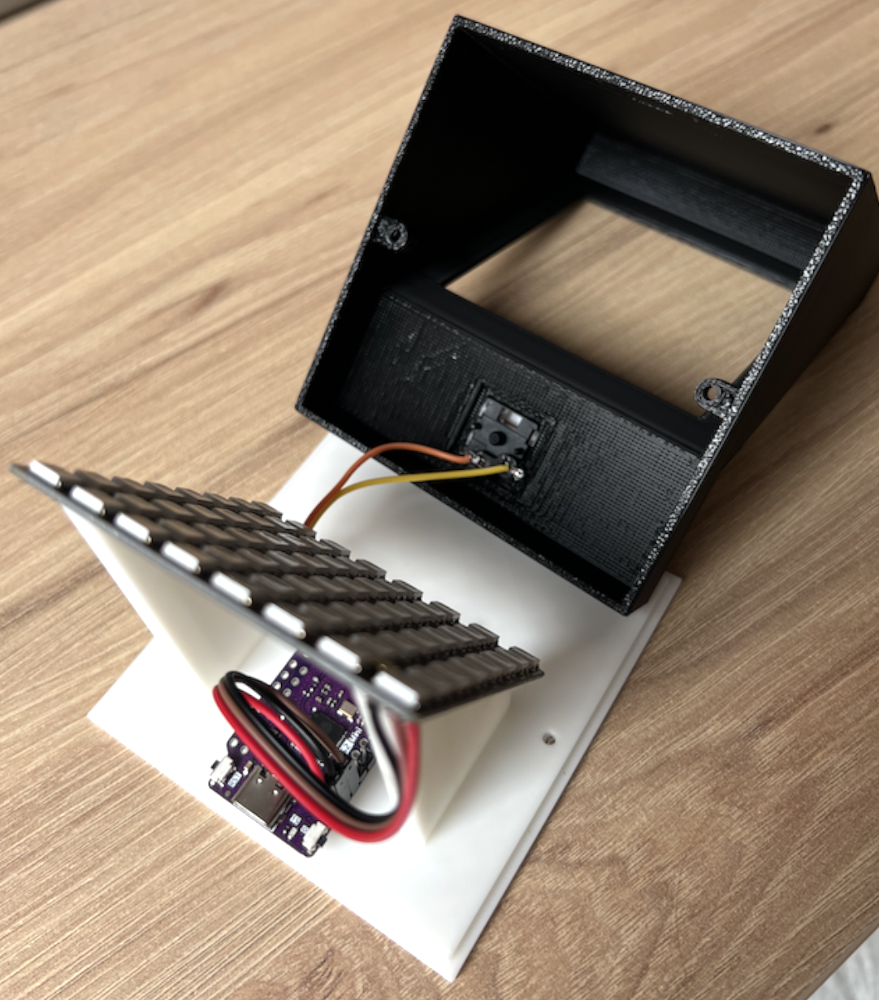
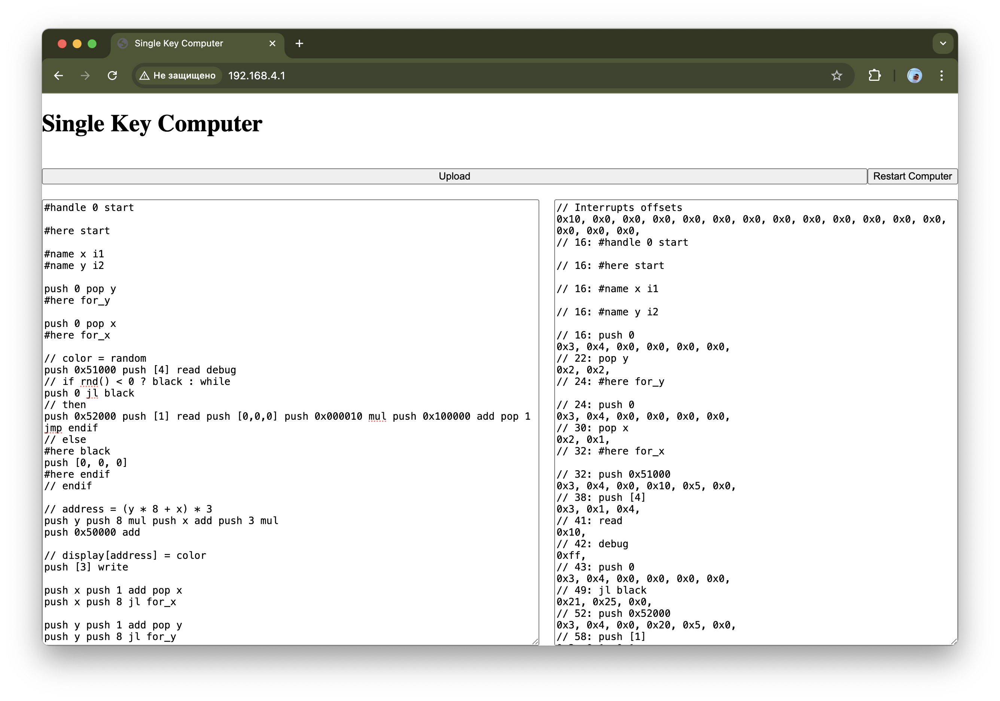

# Single Key Computer

## Components

- ESP32 S2
- WS2812B x64 matrix
- Kailh Switch
- 3D-printed body

## Stack

- Arduino, LittleFS_esp32, Adafruit_NeoPixel
- WiFi
- HTTP
- PReact Web Application

## Web Interface

